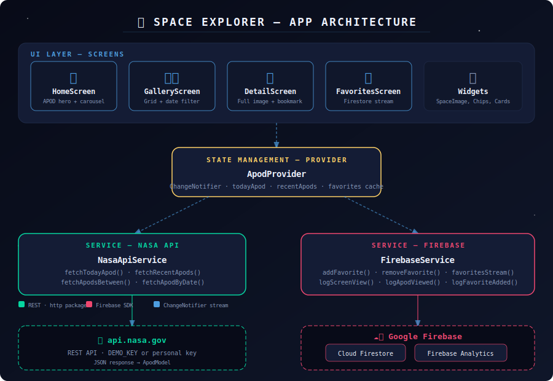

# 🚀 Explorador Espacial

> Explore o universo através da Foto Astronômica do Dia da NASA ( desenvolvido com Flutter & Firebase )

---

## ✨ Funcionalidades

| Funcionalidade | Descrição |
|---|---|
| 🌌 **Foto do Dia** | Foto Astronômica do Dia da NASA exibida em destaque |
| 🖼️ **Galeria** | Navegue pelos últimos 20 dias de imagens espaciais em grade |
| 📅 **Filtro por Data** | Escolha qualquer período desde junho de 1995 |
| ⭐ **Salvar Favoritos** | Salve imagens no Firebase Firestore (deslize para excluir) |
| 📊 **Analytics** | Firebase Analytics registra visualizações e interações |
| 🌍 **Tradução Automática** | Descrições traduzidas automaticamente para português |
| 🎨 **Tema Espacial** | Interface dark com destaques brilhantes e campo de estrelas |

---

## 🛠️ Tecnologias Utilizadas

| Camada | Tecnologia |
|---|---|
| Framework | Flutter 3.x (Dart 3) |
| Gerenciamento de Estado | Provider |
| API | [NASA APOD API](https://api.nasa.gov/) |
| Banco de Dados | Firebase Cloud Firestore |
| Analytics | Firebase Analytics |
| Cache de Imagens | cached_network_image |
| Fontes | Google Fonts (Space Grotesk) |
| HTTP | http |
| Tradução | MyMemory Translation API (gratuita) |

---

## 🏗️ Arquitetura

```
lib/
├── main.dart                      # Entrada do app, init Firebase, Provider
├── firebase_options.dart          # Configurações do Firebase
├── theme.dart                     # Tema, cores e tipografia do app
│
├── models/
│   ├── apod_model.dart            # Modelo de dados da API da NASA
│   └── favorite_model.dart        # Modelo do documento no Firestore
│
├── services/
│   ├── nasa_api_service.dart      # Chamadas à API REST da NASA
│   ├── firebase_service.dart      # CRUD no Firestore + Analytics
│   └── translation_service.dart   # Tradução automática (MyMemory API)
│
├── providers/
│   └── apod_provider.dart         # ChangeNotifier (estado global do app)
│
├── screens/
│   ├── main_shell.dart            # Shell de navegação inferior (IndexedStack)
│   ├── home_screen.dart           # Foto do dia + carrossel recente
│   ├── gallery_screen.dart        # Galeria em grade + filtro por data
│   ├── detail_screen.dart         # Imagem em tela cheia + info + favorito
│   └── favorites_screen.dart      # Lista de favoritos via stream Firestore
│
└── widgets/
    └── common_widgets.dart        # Componentes reutilizáveis de UI
```

Veja o diagrama completo em `docs/architecture.svg`.

---

## 📸 Prints da Aplicação


---


---


---


---


## 🚀 Como Executar

### Pré-requisitos

- Flutter SDK ≥ 3.0.0 ([instalar](https://flutter.dev/docs/get-started/install))
- Dart SDK ≥ 3.0.0
- Um projeto no [Firebase](https://console.firebase.google.com/)
- (Opcional) Uma [chave da API da NASA](https://api.nasa.gov/) — a chave `DEMO_KEY` funciona para testes

### 1. Clonar o repositório

```bash
git clone https://github.com/SEU_USUARIO/space-explorer.git
cd space-explorer
```

### 2. Instalar dependências

```bash
flutter pub get
```

### 3. Configurar o Firebase

1. Acesse [console.firebase.google.com](https://console.firebase.google.com)
2. Crie um projeto (ex: `space-explorer`)
3. Adicione um app Web (para FlutLab/web) ou Android/iOS
4. Ative o **Cloud Firestore** (modo de teste)
5. Ative o **Google Analytics**
6. Copie as credenciais para `lib/firebase_options.dart`

### 4. (Opcional) Configurar chave da NASA

Em `lib/services/nasa_api_service.dart`, substitua:

```dart
static const String _apiKey = 'DEMO_KEY';
```

Pela sua chave obtida em [api.nasa.gov](https://api.nasa.gov).

### 5. Executar o app

```bash
# Web
flutter run -d chrome

# Emulador Android
flutter run -d android

# Simulador iOS (apenas macOS)
flutter run -d ios
```

---

## 🌐 Executando no FlutLab.io

1. Acesse [flutlab.io](https://flutlab.io) e faça login
2. Clique em **"Import Project"** e faça upload do ZIP do projeto
3. Certifique-se de atualizar `lib/firebase_options.dart` com suas credenciais Firebase
4. Clique em **Run** (preview web)

> ⚠️ O FlutLab roda no navegador, então use a configuração Firebase para **web**. As regras do Firestore devem permitir leitura/escrita (modo de teste).

---

## ☁️ Regras do Firestore (Desenvolvimento)

```js
rules_version = '2';
service cloud.firestore {
  match /databases/{database}/documents {
    match /{document=**} {
      allow read, write: if true; // ⚠️ Apenas para testes
    }
  }
}
```

> Para produção, restrinja as escritas a usuários autenticados.

---

## 📐 Diagrama de Arquitetura



---

## 📱 Download / Testar

- **Versão Web**: [Clique aqui para testar online](https://flutlab.io/editor/d4385550-47a5-4856-9b27-823bc67466fc)
- **APK Android**: [Baixar APK](https://github.com/kaique2308/space-explorer/releases/download/v1.0.0/space_explorer.apk)
- **QR Code**


---

## 📄 Licença

MIT © 2025 — Feito com 🚀 e Flutter
